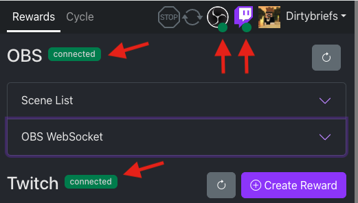

# DirtyPoints – Twitch-OBS Redemptions and Scene Cycling Made Easy

Simple client-side web app that can link your Twitch channel point redemptions to OBS, enabling:
 - scene change and source toggle redemptions
 - integrates with chat so chat commands can trigger scenes and sources
 - built-in scene cycle rotation, which cooperatively work with redemptions, so they do not clobber each other

## Features

- **Privacy #1** - You are not the product. Your data is only stored on your device, never transmitted to a 3rd party.
- **Dock Friendly** - Usable as a custom OBS browser dock, or even from your phone or tablet
- **Reward Management** - Manage your channel point rewards in app
- **OBS Mappings** - Link your rewards created in-app and out of app to OBS
- **Scene Redemptions** - Configure a redemption to change the scene, and optionally change again after some time
- **Source Redemptions** - Configure a redemption to show a scene source, and hide after some time (can trigger sources on multiple scenes)
- **Chat Commands** – Configure a redemption to trigger from a chat command, and optionally require permissions (broadcaster, moderator, etc)
- **Scene Cycle** - Configure scene groups to rotate through on a set interval or arbitrary duration (works cooperatively with scene redemptions)
- **Queue System** - Redemptions are queued, so multiple simultaneous scene redemptions won't clobber each other
- **Import/Export Settings** - Save and load your settings for backup and transferring to other devices
- **OBS Events** - Automatically updates mappings/cycle groups when connected to OBS (e.g. scene/source renames, add/remove, etc) 
- **Fast Toggling** - Easily enable/disable rewards which may not be applicable for the stream

## Add to OBS

Add the app as a custom dock to OBS:
- From the menu, select `Docks` > `Custom Browser Docks...`
- Enter a name for the dock (e.g. `Points`) and the url: `https://points.dirtybriefs.net`
- Click `Apply` - the Dock should now appear, likely behind the Custom Browser Docks dialog.
- Move the dock to where ever you'd like, docking it to OBS or keep it detached for a separate monitor.

## Setup

After signing in with your Twitch account, you will need to set the OBS websocket configuration.

- From the OBS menu, select `Tools` > `WebSocket Server Settings`
  
- Click the `Show Connect Info` button
  
- Click the `Copy` button next to the password. Also make a note of your IP address and server port.
  
- Set the DirtyPoints OBS WebSocket settings to match, and click `Update OBS Settings`. You may use the default `127.0.0.1` host value if DirtyPoints
  is running on the same machine as OBS

When correctly configured, both OBS and Twitch should have a green status icon and show `connected`:

## Brief UI Tour

### Rewards Tab

1. **Navigation Tabs**, switch between twitch reward mapping and scene cycle views
2. **Full Stop**, when enabled, no rewards or scene cycling will happen
3. **Cycle toggle**, will start/pause the last activated scene cycle group
4. **Status Icons**, shows the connection status of OBS and Twitch
5. **Session Dropdown**, import/export settings and sign out of the app
6. **OBS Refresh**, force reconnect to OBS and refreshes scene/source information
7. **Scene List**, shows all the scenes in OBS, use as a crude way to change scenes remotely
8. **OBS WebSocket**, manage the OBS websocket configuration
9. **Twitch Refresh**, force reconnect to Twitch and refreshes reward information
10. **Create Reward**, shows the Create Twitch Reward modal 
11. **Reward Group Tabs**, switch between manageable rewards (ones created by this app) and other rewards (ones created outside this app)
12. **Toggle Reward**, enable or disable a Twitch reward (show/hide in the channel points Twitch UX)
13. **Manage Reward**, click the reward name to manage the Twitch reward settings
14. **Manage OBS Mapping**, click to manage the scene/source settings
15. **Trigger**, manually trigger a redemption for testing

### Cycle Tab 

16. **Create Scene Group**, create a new scene cycle group by entering a name and pressing `Create Group`
17. **Scene Groups**, all your scene groups, click to expand group configuration
18. **Start Cycle**, click to start the scene group cycling
19. **Drag Handle**, click and drag to reorder scenes in the group
20. **Scene Enabled**, click to enable or disable the scene in the group
21. **Scene Selection**, change the OBS scene
22. **Scene Duration**, override the base group duration (in seconds). Use `0` to use the base group duration.
23. **Delete Scene**, click to remove the scene from the group
24. **Add Scene**, click to add a new blank scene entry to the group
25. **Edit Group**, click to change the group name
26. **Delete Group**, click to delete the scene cycle group
27. **Base Duration**, change the base duration of each scene in the group (in seconds).

> By default, a scene in the group will be shown for the base duration (in seconds), unless overridden.

### Create/Manage Reward Modal

The create/manage reward modal contains all the fields available to be managed via API. 

> Note: Reward icons must be managed on the Twitch dashboard.

Configure the settings to work for you. Consider adding a cooldown to prevent viewers from rapidly redeeming scene
changes, and skip the queue so your mods don't have to clean up the redemption queue every stream 😅

You can use the delete and clone icons at the bottom of the modal to do exactly that! 

> Hint: If you are migrating channel point redemptions from another app, use the Clone button copy the configuration to 
> a new redemption, manageable by DirtyPoints. (The icon will not transfer, however)

### OBS Reward Mapping

This is where you set what the reward does in OBS.

There are two types of reward mappings, **Scene Change** and **Source Toggle**.

1. **Scene Change** - When redeemed, the OBS will change to the selected scene for the configured duration 
2. **Source Toggle** - When redeemed, OBS will show the selected scene _sources_ for the configured duration

Configuration:

- **OBS Scene**, OBS scene to change to, unless scene items are also selected
- **Scene Items**, when one or more scene items are selected, the mapping becomes a **source toggle**, and will trigger visibility on the selected scene items
- **Items on other scenes**, click to expand to select sources on additional scenes. This allows you to show items on multiple scenes at the same time
- **Timeout**, duration to show the scene/sources (in seconds). When timeout is `0`, the scene will not be changed.
- **Scene on Timeout**, the scene to change to after the duration elapses. (Only applies to scene changes, not source toggles)
- **Chat Command / Text**, optionally trigger the reward from chat that matches the given text
- **Limit Command to**, optionally limit the chat command to viewers with the given badges. Permissions do not inherit, e.g. moderator does not include broadcaster, so select all that apply, or leave blank to allow anyone
- **Delete**, remove the mapping

> **Scene Cycle Integration**: When a scene cycle group is active, and a scene reward is redeemed, the reward scene will
> be displayed until the reward timeout elapses. If not set, the cycle group base duration will be used. 
> Then the next scene in the cycle group will be displayed. The cycle start/stop icon will change color to 
> indicate that the cycle has been paused while the reward is executing.

### Examples

#### Camera View Redemption
The most basic function is for a redemption to change the scene. For example:

- Set `OBS Scene` to the corresponding camera scene
- If you'd like to only temporarily show that view and return to the main scene, set `Timeout` and `Scene on Timeout` 

#### Video Redemption
Perhaps you have a fixed-length video scene, like a timelapse, that you want to play out entirely before changing scene.

- Set the `OBS Scene` to the corresponding video scene
- Set the `Timeout` to the duration of the video
- Set the `Scene on Timeout` to your main scene

> Note: If a cycle group is active, the `Scene on Timeout` will be overridden with the next scene in the group

#### Show Event Flyer
Maybe you'd like to let the viewers show/hide the event flyer you are on, which is a scene source on multiple scenes

- Set the `OBS Scene` the flyer source is on
- Set the `Scene Items`, selecting your flyer source
- Set the `Timeout` to how long you want the flyer source to show for
- Optionally, if you have the flyer source on other scenes too, use the `Items on other scenes` to set those up

For example:

In this screenshot, the Flyer Container source exists on four different scenes, and will all be toggled on for 21 seconds
and then off, all at the same time. Viewers can also use the `!flyer` command to trigger the redemption.

### Helpful Tips

When working with redemptions and cycle groups, it's best to think of how the two will interact with each other.

For example, 

- Some rewards should show a scene for a specific duration and return to a regular scene after.
> Make sure to set the timeout and scene to return to upon timeout. If a cycle group is active, the next group scene 
> will be used instead. 

- Some rewards should show a scene and may remain there until changed (either by reward or cycle) 
> Set the timeout to the minimum amount of time you think the scene should show for (e.g. 60) and then set the timeout 
> scene to itself. If a cycle group is active, the next group scene will be used instead.

## Privacy & Permissions

This app runs entirely within the browser, and does not use a 3rd-party server for data storage or data collection. Your
data is your data, and is not mined, stored, etc. The application is open source (clearly, since you are here reading 
about it) and will always be that way.

The permissions the app requires to run:
- `channel:manage:redemptions` - Needed to retrieve and manage channel point rewards
- `user:read:chat` - Needed to trigger redemptions via chat commands

That's it. Really basic! 

# Changelog

### v1.0.0 - 2024-07-28
Initial public release with documentation! 🎉
- Added error reporting

### v0.4.0 - 2024-07-28
- Added optional chat badge requirement to use chat command redemption
- Added full stop button to prevent any rewards from executing while enabled
- Changed scene cycle active icon 

### v0.3.1 – 2024-07-26
Sort channel point rewards by name

### v0.3.0 – 2024-07-15
Added OBS event handling for when scenes/items are added/updated/deleted/renamed/etc 

### v0.2.0 – 2024-07-14
Added export modal since OBS browser docks cannot download files

### v0.1.0 – 2024-07-14
Initial working build, months of unfinished work previous to this 🤣

# Toolchain

This project was bootstrapped with [Create React App](https://github.com/facebook/create-react-app).

## Available Scripts

In the project directory, you can run:

### `npm start`

Runs the app in the development mode.\
Open [http://localhost:3000](http://localhost:3000) to view it in your browser.

The page will reload when you make changes.\
You may also see any lint errors in the console.

### `npm test`

Launches the test runner in the interactive watch mode.\
See the section about [running tests](https://facebook.github.io/create-react-app/docs/running-tests) for more information.

### `npm run build`

Builds the app for production to the `build` folder.\
It correctly bundles React in production mode and optimizes the build for the best performance.

The build is minified and the filenames include the hashes.\
Your app is ready to be deployed!

See the section about [deployment](https://facebook.github.io/create-react-app/docs/deployment) for more information.

### `npm run eject`

**Note: this is a one-way operation. Once you `eject`, you can't go back!**

If you aren't satisfied with the build tool and configuration choices, you can `eject` at any time. This command will remove the single build dependency from your project.

Instead, it will copy all the configuration files and the transitive dependencies (webpack, Babel, ESLint, etc) right into your project so you have full control over them. All of the commands except `eject` will still work, but they will point to the copied scripts so you can tweak them. At this point you're on your own.

You don't have to ever use `eject`. The curated feature set is suitable for small and middle deployments, and you shouldn't feel obligated to use this feature. However we understand that this tool wouldn't be useful if you couldn't customize it when you are ready for it.

## Learn More

You can learn more in the [Create React App documentation](https://facebook.github.io/create-react-app/docs/getting-started).

To learn React, check out the [React documentation](https://reactjs.org/).

### Code Splitting

This section has moved here: [https://facebook.github.io/create-react-app/docs/code-splitting](https://facebook.github.io/create-react-app/docs/code-splitting)

### Analyzing the Bundle Size

This section has moved here: [https://facebook.github.io/create-react-app/docs/analyzing-the-bundle-size](https://facebook.github.io/create-react-app/docs/analyzing-the-bundle-size)

### Making a Progressive Web App

This section has moved here: [https://facebook.github.io/create-react-app/docs/making-a-progressive-web-app](https://facebook.github.io/create-react-app/docs/making-a-progressive-web-app)

### Advanced Configuration

This section has moved here: [https://facebook.github.io/create-react-app/docs/advanced-configuration](https://facebook.github.io/create-react-app/docs/advanced-configuration)

### Deployment

This section has moved here: [https://facebook.github.io/create-react-app/docs/deployment](https://facebook.github.io/create-react-app/docs/deployment)

### `npm run build` fails to minify

This section has moved here: [https://facebook.github.io/create-react-app/docs/troubleshooting#npm-run-build-fails-to-minify](https://facebook.github.io/create-react-app/docs/troubleshooting#npm-run-build-fails-to-minify)
